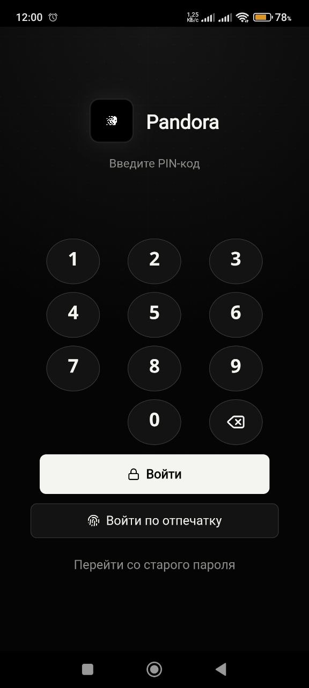

<p align="center">
  
</p>

<h1 align="center">PANDORA</h1>

<p align="center">
  <strong>Пароли остаются вашими.</strong><br>
  Локальное зашифрованное хранилище для Windows и Android без аккаунта Pandora.
</p>

<p align="center">
  <a href="https://github.com/whoisyonaa/pandora/releases/latest"></a>
  
  
  
</p>

<p align="center">
  <a href="https://github.com/whoisyonaa/pandora/releases/download/v0.2.0/Pandora-Setup-0.2.0.exe"><strong>Скачать для Windows</strong></a>
  &nbsp;&nbsp;·&nbsp;&nbsp;
  <a href="https://github.com/whoisyonaa/pandora/releases/download/v0.2.0/Pandora-Android-0.2.0.apk"><strong>Скачать APK</strong></a>
  &nbsp;&nbsp;·&nbsp;&nbsp;
  <a href="https://github.com/whoisyonaa/pandora/releases/download/v0.2.0/Pandora-Portable-0.2.0.exe"><strong>Portable</strong></a>
</p>

<p align="center">
  <a href="#скачать">Скачать</a> ·
  <a href="#возможности">Возможности</a> ·
  <a href="#синхронизация">Синхронизация</a> ·
  <a href="#безопасность">Безопасность</a> ·
  <a href="#english">English</a>
</p>

---

## Pandora

Pandora хранит пароли локально в зашифрованном хранилище и синхронизирует между устройствами только зашифрованный файл. У приложения единый мастер-пароль для расшифровки данных и отдельная локальная защита входа через PIN или биометрию.

<table>
  <tr>
    <td width="33%"><strong>Локально</strong><br><sub>Нет обязательного аккаунта и собственного сервера Pandora.</sub></td>
    <td width="33%"><strong>Зашифровано</strong><br><sub>AES-256-GCM и ключ из мастер-пароля.</sub></td>
    <td width="33%"><strong>На двух платформах</strong><br><sub>Windows installer/portable и подписанный Android APK.</sub></td>
  </tr>
</table>

> [!IMPORTANT]
> Одинаковый мастер-пароль должен использоваться на всех устройствах. Локальные PIN-коды могут отличаться и не участвуют в шифровании облачного файла.

## Скачать

Готовые сборки находятся в [GitHub Releases](https://github.com/whoisyonaa/pandora/releases/latest).

| Платформа | Файл | Для чего |
| --- | --- | --- |
| Windows | `Pandora-Setup-0.2.0.exe` | Обычная установка и обновление поверх предыдущей версии |
| Windows | `Pandora-Portable-0.2.0.exe` | Запуск без установки |
| Android | `Pandora-Android-0.2.0.apk` | Подписанный APK для ручной установки |
| Проверка | `SHA256SUMS.txt` | Контрольные суммы файлов релиза |

При обновлении Windows закройте Pandora и запустите новый установщик. Хранилище и локальные настройки не удаляются. На Android установите новый APK поверх существующего приложения с тем же package ID и подписью.

> [!NOTE]
> Android APK подписан постоянным release-ключом Pandora. Windows EXE пока не имеет коммерческого Authenticode-сертификата, поэтому SmartScreen может показать предупреждение для нового издателя.

## Интерфейс

### Windows · хранилище

<p align="center">
  
</p>

<table>
  <tr>
    <td width="50%" align="center"><strong>Вход и создание хранилища</strong></td>
    <td width="50%" align="center"><strong>Настройки и темы</strong></td>
  </tr>
  <tr>
    <td></td>
    <td></td>
  </tr>
</table>

### Android · хранилище, PIN и биометрия

<p align="center">
  Мобильный интерфейс использует крупные touch-цели, нижнюю навигацию и отдельный локальный вход.
</p>

<table>
  <tr>
    <td width="50%" align="center"><strong>Список записей</strong></td>
    <td width="50%" align="center"><strong>Защищённый вход</strong></td>
  </tr>
  <tr>
    <td align="center" valign="top"></td>
    <td align="center" valign="top"></td>
  </tr>
</table>

<p align="center"><sub>Скриншоты: Windows и Android · Pandora v0.2.x</sub></p>

## Возможности

| | |
| --- | --- |
| **Записи** | Логин, пароль, URL, заметки, папка, поиск и сортировка |
| **Пароли** | Генератор в редакторе, просмотр, безопасное копирование |
| **Иконки** | Favicon по домену, файл, URL изображения и вставка из буфера |
| **Организация** | Папки, перенос записей, корзина, восстановление и окончательное удаление |
| **Синхронизация** | Koofr и другие совместимые WebDAV-сервисы |
| **Локальный вход** | PIN от 4 цифр; после трёх ошибок требуется мастер-пароль |
| **Android** | Адаптивный интерфейс, touch drag-and-drop, PIN и биометрия |
| **Диагностика** | Экспорт очищенных от секретов debug-логов |

## Синхронизация

Рекомендуемый вариант — **Koofr через WebDAV**:

1. Создайте аккаунт Koofr.
2. Откройте `Account settings → Preferences → Password` и создайте app password.
3. В Pandora откройте настройки облака и укажите адрес WebDAV, email Koofr, app password и имя файла.
4. Используйте один и тот же мастер-пароль на Windows и Android.
5. На устройстве с актуальными данными нажмите «Сохранить в облако».
6. На втором устройстве нажмите «Загрузить из облака» или выполните синхронизацию.

Записи, папки и состояние корзины находятся внутри одного зашифрованного `.pandora`-файла. Данные WebDAV не записываются в debug-логи в открытом виде.

## Безопасность

Новые хранилища используют:

- `PBKDF2-SHA-256`, 600 000 итераций;
- `AES-256-GCM`;
- случайные salt и IV для каждого шифрования;
- Android Keystore или Windows DPAPI для локально сохранённого мастер-пароля;
- локальный PIN, хешированный через PBKDF2;
- только HTTPS для WebDAV.

Мастер-пароль нельзя восстановить. PIN является только локальной прослойкой входа и не заменяет мастер-пароль. Pandora не отправляет содержимое хранилища на собственный сервер.

> [!WARNING]
> Версия `0.2.0` является ранним релизом и не проходила независимый аудит безопасности. Храните резервную копию `.pandora` и самостоятельно оценивайте риск перед использованием для критичных учётных записей.

## Сборка

Требуются Node.js, npm, Java 21 и Android SDK. Windows-сборки создаются на Windows.

```powershell
npm install
npm test -- --run
npm run build
npm run dist:win
npm run apk:release
```

Release APK собирается только при наличии локального keystore в `%USERPROFILE%\.pandora-signing`. Keystore, пароли подписи, сборки и пользовательские данные исключены из Git.

<details>
<summary><strong>Структура проекта</strong></summary>

```text
android/       Capacitor Android и native auth plugin
electron/      Electron main/preload и Windows device auth
src/           React UI, vault, crypto, sync и тесты
public/        Статические ресурсы интерфейса
docs/          Логотип и изображения README
scripts/       Скрипты сборки релизов
```
</details>

---

<a id="english"></a>

<p align="center"></p>

## English

**Pandora** is a local encrypted password manager for Windows and Android. It keeps the vault encrypted at rest and syncs only the encrypted file through Koofr or another compatible WebDAV provider.

> [!IMPORTANT]
> Use the same master password on every device. Device PINs may differ because they only protect local app access.

### Downloads

Get the current builds from [GitHub Releases](https://github.com/whoisyonaa/pandora/releases/latest).

| Platform | File | Purpose |
| --- | --- | --- |
| Windows | `Pandora-Setup-0.2.0.exe` | Installer and in-place updates |
| Windows | `Pandora-Portable-0.2.0.exe` | Portable build |
| Android | `Pandora-Android-0.2.0.apk` | Signed sideload APK |
| Verification | `SHA256SUMS.txt` | Release file checksums |

The Android APK is signed with Pandora's persistent release key. Windows executables are not Authenticode-signed yet, so SmartScreen may warn about an unknown publisher.

### Features

- encrypted local vault with folders, search, trash and recovery;
- login, password, URL, notes, generator and custom icons;
- Koofr/WebDAV sync for records, folders and trash state;
- device-local PIN and Android biometric unlock;
- Windows installer with upgrade support and a portable build;
- exportable debug logs with sensitive fields redacted.

### Security

New vaults use PBKDF2-SHA-256 with 600,000 iterations and AES-256-GCM with random salt and IV. The locally cached master password is protected through Android Keystore or Windows DPAPI. WebDAV requires HTTPS.

The master password cannot be recovered. The PIN is a local access layer, not the cloud encryption key. Pandora has no proprietary sync server.

> [!WARNING]
> `0.2.0` is an early release and has not undergone an independent security audit. Keep backups and assess the risk before storing critical credentials.

### Build From Source

```powershell
npm install
npm test -- --run
npm run build
npm run dist:win
npm run apk:release
```

---

<p align="center"><sub>Local vault. Explicit sync. No account required by Pandora.</sub></p>
