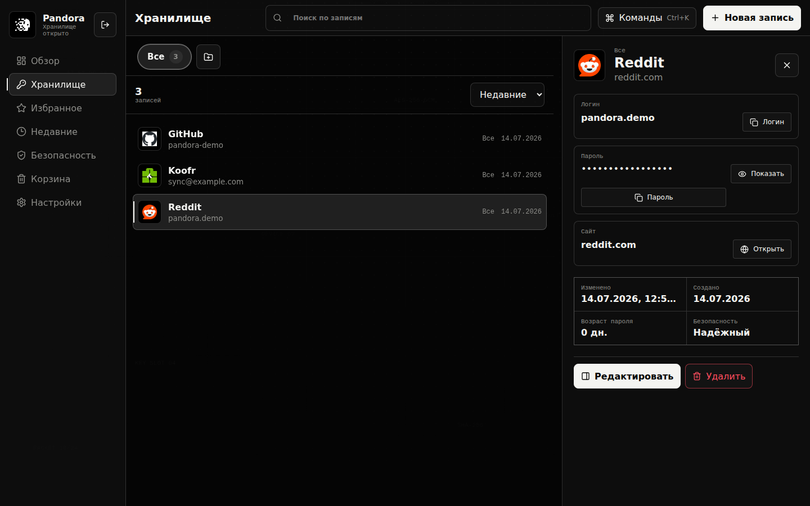
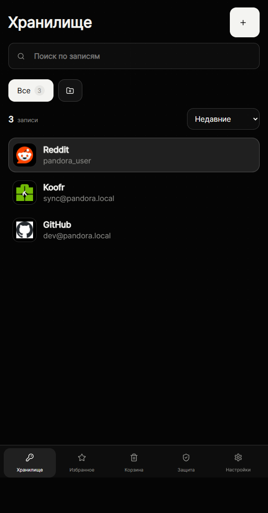
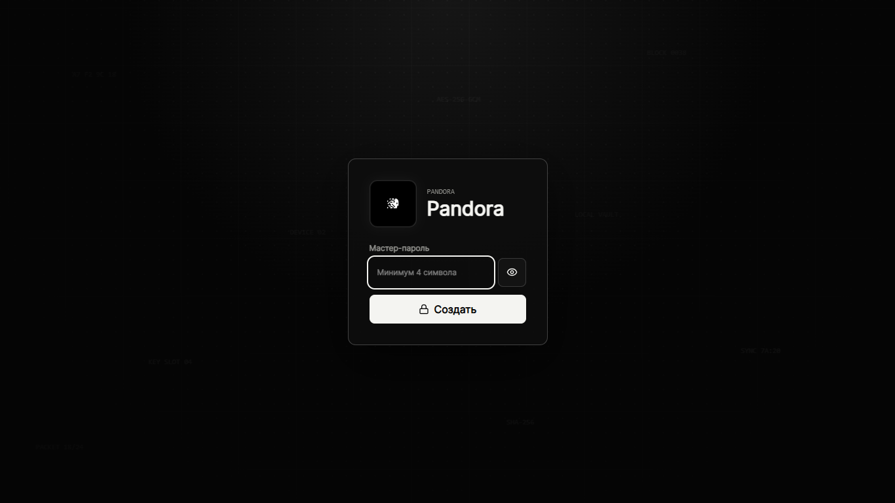
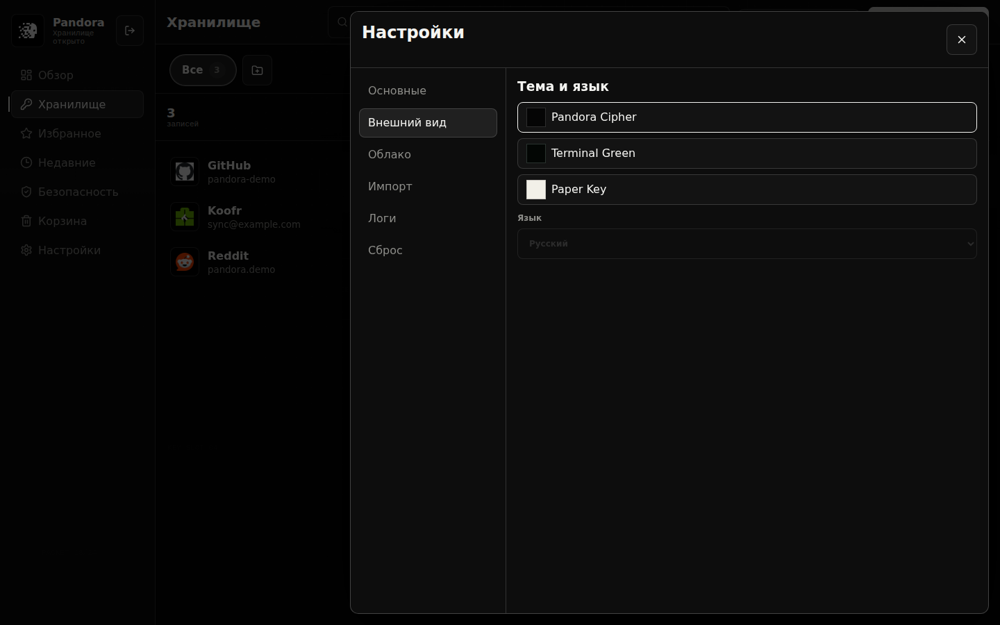

<p align="center">
  
</p>

<h1 align="center">Pandora</h1>

<p align="center">
  Локальный зашифрованный менеджер паролей для Windows и Android.
</p>

<p align="center">
  <a href="https://github.com/whoisyonaa/pandora/releases/latest">
    
  </a>
  
  
  
</p>

<p align="center">
  <a href="#скачать">Скачать</a>
  ·
  <a href="#скриншоты">Скриншоты</a>
  ·
  <a href="#возможности">Возможности</a>
  ·
  <a href="#безопасность">Безопасность</a>
  ·
  <a href="#english">English</a>
</p>

---

## О проекте

**Pandora** — это локальный менеджер паролей с зашифрованным хранилищем, русским интерфейсом, приложением для Windows, APK для Android и синхронизацией между устройствами через Koofr/WebDAV.

Интерфейс сделан в стиле **Dark Minimalist / Cryptography / Retro Terminal**: монохромная палитра, простая навигация, быстрый доступ к логину и паролю, минимум визуального шума.

> Важно: Pandora — ранний релиз. Проект пока не проходил внешний security audit, поэтому перед хранением критически важных паролей используйте собственные резервные копии и оценивайте риски.

## Скачать

Последняя версия доступна в разделе [GitHub Releases](https://github.com/whoisyonaa/pandora/releases/latest).

| Платформа | Файл | Назначение |
| --- | --- | --- |
| Windows | `Pandora-Setup-0.1.3.exe` | Установщик |
| Windows | `Pandora-Portable-0.1.3.exe` | Portable-версия |
| Android | `Pandora-Android-0.1.3-debug.apk` | APK для ручной установки |

## Скриншоты

### Windows



### Android

<p align="center">
  
</p>

### Вход и темы

<table>
  <tr>
    <td width="50%">
      
    </td>
    <td width="50%">
      
    </td>
  </tr>
</table>

## Возможности

| Область | Что есть |
| --- | --- |
| Хранилище | Локальные записи, папки, поиск, сортировка, быстрый просмотр |
| Безопасность | Мастер-пароль, AES-GCM 256-bit, PBKDF2-SHA-256, локальное шифрование |
| Записи | Логин, пароль, сайт, заметки, папка, кастомная иконка |
| Пароли | Генератор внутри формы записи, просмотр через кнопку-глаз, копирование |
| Иконки | Favicon по домену, загрузка файла, URL картинки, вставка через буфер |
| Корзина | Мягкое удаление, восстановление, удаление навсегда |
| Синхронизация | Koofr/WebDAV, локальный Wi-Fi обмен как дополнительный вариант |
| Платформы | Windows EXE/installer и Android APK |
| Android | Адаптивный мобильный интерфейс, bottom navigation, биометрический вход при поддержке устройства |
| Диагностика | Экспорт debug logs для поиска проблем |

## Безопасность

Pandora шифрует данные локально перед сохранением и синхронизацией.

Текущая криптография:

- PBKDF2-SHA-256;
- 250 000 итераций;
- AES-GCM 256-bit;
- случайные salt и IV при шифровании.

Ключевые ограничения:

- мастер-пароль не восстанавливается;
- без мастер-пароля расшифровать хранилище нельзя;
- синхронизация передаёт только зашифрованный `.pandora` файл;
- проект пока не проходил внешний аудит безопасности.

## Синхронизация

Основной рекомендуемый способ — **Koofr через WebDAV**.

1. Создайте аккаунт Koofr.
2. Создайте app password: `Account settings -> Preferences -> Password`.
3. В Pandora укажите WebDAV URL, email Koofr и app password.
4. Используйте одинаковый мастер-пароль на Windows и Android.
5. Синхронизируйте устройство с актуальными данными.
6. Синхронизируйте второе устройство.

Состояние корзины синхронизируется вместе с записями: удалённая запись появляется в корзине на другом устройстве, пока не будет удалена навсегда.

## Интерфейс

Pandora использует один React-интерфейс, адаптированный под две платформы:

- **Windows**: sidebar, command bar, список записей и правая панель деталей.
- **Android**: компактный top bar, поиск, папки, список, bottom navigation и bottom sheet для деталей.

Цель интерфейса — быстро открыть запись, скопировать логин/пароль и не отвлекаться на лишние экраны.

## Сборка из исходников

Требования:

- Node.js;
- npm;
- Java 21 для Android-сборки;
- Android SDK для APK;
- Windows для сборки `.exe`.

```bash
npm install
npm test -- --run
npm run build
```

Windows installer и portable:

```bash
npm run dist:win
```

Android debug APK:

```bash
npm run apk:debug
```

Android script в `package.json` использует локальные пути Windows-разработчика:

```text
JAVA_HOME=C:\Program Files\Microsoft\jdk-21.0.11.10-hotspot
ANDROID_HOME=%LOCALAPPDATA%\Android\Sdk
```

Если у вас другие пути, измените скрипт под свою систему.

## Структура проекта

```text
android/              Capacitor Android project
build/                Windows icon and build assets
electron/             Electron main process
public/               Static assets
src/                  React app, crypto, sync and storage logic
src/lib/cryptoVault.ts
src/lib/syncEngine.ts
src/lib/webdavSync.ts
src/types/vault.ts
docs/                 README assets and screenshots
```

## Статус

Pandora уже собирается в Windows EXE и Android APK, но остаётся ранним релизом. Перед использованием для критически важных паролей нужен внешний аудит, больше тестов и аккуратная проверка сценариев обновления, восстановления и резервного копирования.

---

<a id="english"></a>

<p align="center">
  
</p>

# Pandora

> A local encrypted password manager for Windows and Android.

Pandora is a local-first password manager with an encrypted vault, Windows desktop builds, Android APK builds and cross-device sync through Koofr/WebDAV.

The interface follows a **Dark Minimalist / Cryptography / Retro Terminal** direction: monochrome, focused and intentionally quiet.

> Important: Pandora is an early release. It has not passed an external security audit yet.

## Download

Current builds are available in [GitHub Releases](https://github.com/whoisyonaa/pandora/releases/latest).

| Platform | File | Purpose |
| --- | --- | --- |
| Windows | `Pandora-Setup-0.1.3.exe` | Installer |
| Windows | `Pandora-Portable-0.1.3.exe` | Portable build |
| Android | `Pandora-Android-0.1.3-debug.apk` | APK sideload |

## Screenshots


<p align="center">
  
</p>

## Features

| Area | Included |
| --- | --- |
| Vault | Local entries, folders, search, sorting, quick preview |
| Security | Master password, AES-GCM 256-bit, PBKDF2-SHA-256, local encryption |
| Entries | Login, password, site, notes, folder, custom icon |
| Passwords | Built-in generator, reveal button, copy actions |
| Icons | Favicon by domain, local upload, image URL, clipboard paste |
| Trash | Soft delete, restore, permanent delete |
| Sync | Koofr/WebDAV and optional local Wi-Fi transfer |
| Platforms | Windows EXE/installer and Android APK |
| Android | Adaptive mobile layout, bottom navigation, biometric unlock when supported |
| Diagnostics | Exportable debug logs |

## Security

Pandora encrypts vault data locally before saving or syncing it.

Current crypto implementation:

- PBKDF2-SHA-256;
- 250,000 iterations;
- AES-GCM 256-bit;
- random salt and IV for encryption.

Important notes:

- there is no master password recovery;
- the vault cannot be decrypted without the master password;
- sync uploads only an encrypted `.pandora` file;
- the project has not passed an external security audit yet.

## Sync

The recommended sync method is **Koofr through WebDAV**.

1. Create a Koofr account.
2. Create an app password: `Account settings -> Preferences -> Password`.
3. Enter WebDAV URL, Koofr email and app password in Pandora.
4. Use the same master password on Windows and Android.
5. Sync from the device that has the newest data.
6. Sync from the second device.

Trash state is synced too: a deleted entry appears in trash on the other device until it is permanently deleted.

## Build From Source

```bash
npm install
npm test -- --run
npm run build
```

Windows installer and portable app:

```bash
npm run dist:win
```

Android debug APK:

```bash
npm run apk:debug
```

## Project Status

Pandora already builds as a Windows EXE and Android APK, but it is still an early release. Before using it for critical passwords, it needs an external audit, broader testing and careful validation of update, recovery and backup scenarios.
